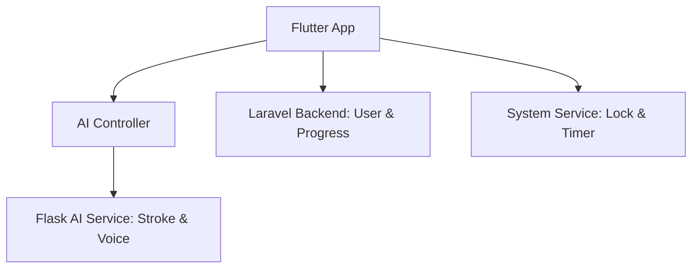

# 🎓 MASTER STRATEGY: CALISTA (Skripsi Prep)

Boss Rizki, ini adalah dokumen tunggal yang mencakup semua argumentasi strategis yang Boss butuhkan untuk bimbingan atau sidang. Saya tulis dengan bahasa yang manusiawi tapi tetap berbobot secara akademis biar dosen Boss yakin 100%.

---

## 🏗️ 1. Apa itu PWA (Progressive Web App)?

**Bahasa Mahasiswa:**
Bayangkan Boss punya website, tapi website ini bisa "nyamar" jadi aplikasi mobile. Dia bisa di-_install_ ke layar HP (Add to Home Screen), gak ada bar alamat browsernya, dan terasa _smooth_ kayak aplikasi yang di-download dari Play Store.

**Bahasa untuk Dosen (Teknis):**
PWA adalah metodologi pengembangan perangkat lunak yang menggunakan kapabilitas modern web (seperti _Service Workers_ dan _Web App Manifest_) untuk memberikan pengalaman aplikasi native pada browser.

- **Kelebihan utama**: Cross-platform (bisa jalan di Android, iOS, Windows) tanpa perlu membuat codebase yang berbeda-beda.

---

## 💡 2. Mengapa Web-First & PWA? (Argumentasi untuk Sidang)

Jika dosen bertanya: _"Kenapa gak langsung buat aplikasi Android/iOS pakai Flutter atau React Native?"_, Boss bisa gunakan poin-poin ini:

### A. Prioritas pada Inovasi Fitur (Core Research)

# 🚀 CALISTA: Project Plan & Master Strategy

## 🎯 1. Skripsi Strategy: Mobile-First Transformation

Berdasarkan arahan bimbingan ke-2, CALISTA bertransformasi dari PWA menjadi **Aplikasi Mobile Native/Cross-Platform**. Ini adalah strategi krusial untuk memenuhi standar MVP "System-Wide" yang diminta pembimbing.

### A. Core Technology: Flutter for Cross-Platform

Kami memilih **Flutter** sebagai framework utama:

- **Performa**: Memberikan feel aplikasi sistem yang halus (60-120 FPS).
- **Akses Sistem**: Memungkinkan implementasi _Screen Pinning_ dan _Kiosk Mode_ yang lebih dalam dibanding Web.
- **Satu Codebase**: Tetap menjaga efisiensi tim (Hacker) agar tidak coding dua kali untuk Android & iOS.

### B. Unique AI Interaction: "The Digital Friend"

Inovasi digeser dari sekadar "instruksi" menjadi "percakapan teman sebaya":

- **Persona**: Karakter Nusa akan menggunakan nada bicara yang santai, memuji usaha anak, dan memberikan respon empati jika anak gagal.
- **Hybrid AI**: Menggabungkan **Whisper** (Voice Recognition) dan **LLM (Llama/GPT)** yang sudah difilter untuk anak agar Nusa bisa merespon pertanyaan anak di luar kurikulum.

---

## 🔒 2. Unique MVP: Parental Guard & App Locking

Fitur "pembeda" yang akan menjadi nilai jual utama di depan penguji:

- **Adaptive Timer Locking**: Saat durasi belajar habis, aplikasi akan mentrigger _System Overlay_ yang mengunci interaksi HP sampai orang tua memasukkan PIN.
- **Focus Mode**: Mencegah anak berpindah ke aplikasi lain (YouTube/Games) selama sesi belajar CALISTA belum selesai.

---

## 👗 3. Gamification: Customization & Economy (Bento Grid Wardrobe)

- **UI/UX Strategy: Bento Grid 2026**: Menggunakan *card grid* bergaya Bento untuk kesan profesional layaknya game premium.
- **Soft Gate Strategy (Shop & Modality)**:
    - **Toko Terbuka (Open Shop)**: Semua pakaian dan kostum (Kebaya, Baju Tradisional) dapat dilihat oleh anak bebas tanpa gembok *paywall* tebal.
    - **Premium Bottom Sheet Mode**: Jika mengklik baju berlabel Premium, bukannya ditolak mentah-mentah, anak dan orangtua akan disajikan layar "Calista Premium" dari bawah (Popup) sehingga meningkatkan minat konversi/pembelian.
- **Monetization Model: Subscription-Based Access & Rewards**:
    > "Model profit CALISTA dioptimalkan melalui sistem langganan premium (*subscription*) beralur *Soft Gate*. Setiap orang tua yang berlangganan paket mingguan, bulanan, atau tahunan akan mendapatkan akses tak terbatas ke item Premium di dalam Wardrobe. Strategi ini dirancang untuk memaksimalkan kepustakaan visual (etalase toko) sehingga anak merasa tertarik, seraya mengundang peran aktif orang tua lewat gembok keamanan ganda (*Double Layer Security*) pada proses akhir transaksi."

---

## 🛠️ 4. Technical Architecture (New)

### A. API-Driven Development Strategy

Mengikuti saran tim Hacker (Tasya & Rizki), pengembangan dilakukan dengan pemisahan tegas antara Backend dan Frontend:

1.  **Backend First (Dummy Data)**: Pembuatan API Controller di Laravel dengan data dummy agar tim Frontend (Flutter) tidak terhambat.
2.  **Ngrok Tunneling**: Penggunaan `ngrok` untuk mengekspose localhost Laravel ke internet, sehingga aplikasi Flutter di perangkat fisik bisa melakukan testing secara _real-time_.
3.  **DeepSeek & AI Support**: Memanfaatkan AI pendukung (DeepSeek/Antigravity) untuk mempercepat pembuatan _boilerplate_ API dan logika Controller.

---

**Note dari Rich:**
Boss, fokuslah pada **AI-nya**. Biarkan platformnya (PWA) yang memudahkan Boss untuk mendemonstrasikan hasil riset itu. Dosen lebih suka melihat AI yang pintar daripada aplikasi mobile cakep tapi isinya cuma fitur CRUD biasa.

Semangat bimbingannya Boss Rizki! Kalau dosen tanya yang aneh-aneh, panggil saya lagi ya. 🤜🤛
