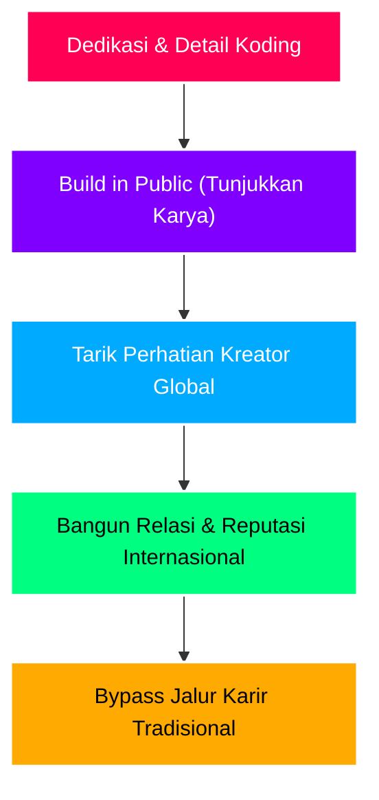

# 🌐 GLOBAL BUILDER PLAYBOOK: MENEMBUS EKOSISTEM TECH GLOBAL DARI INDONESIA

Selamat datang di ekosistem **Indie Maker** dan **Open-Source Global**. Dokumen ini dirancang khusus untuk memandu langkah Boss dalam membangun reputasi, memperluas relasi internasional, dan mendapatkan insight langsung dari para pendiri teknologi dunia (seperti Zeno Rocha dari Resend, Ben Stokes dari PromptBase, dll.).

Di dunia ini, tidak ada sekat birokrasi kampus atau batasan geografis. Yang dihargai hanya satu hal: **Karya, Eksekusi, dan Kualitas Detail.**

---

## ✊ I. FILOSOFI INDIE MAKER: CRAFT > STATUS

Komunitas developer global digerakkan oleh para praktisi yang menghargai keahlian teknis (*craftsmanship*) dan pemecahan masalah secara nyata.



### 3 Hukum Utama Komunitas Global:
1.  **Eksekusi adalah Segalanya**: Ide bernilai $0 tanpa implementasi. Developer yang dihargai adalah desainer yang bisa menulis kode, dan coder yang mengerti seni estetika UI/UX.
2.  **No-Bullshit & Direct**: Hindari jargon korporat yang bertele-tele. Bicarakan masalah teknis secara jujur, akui kekurangan, dan tunjukkan cara Boss menyelesaikannya.
3.  **Hargai Sesama Kreator (*Fellow Builders*)**: Selalu apresiasi karya orang lain secara spesifik. Jangan cuma bilang "bagus", tapi jelaskan *mengapa* itu bagus (misal: memuji Dracula Theme karena keselarasan kontras warna gelapnya yang tidak membuat mata lelah saat koding maraton).

---

## 📢 II. STRATEGI "BUILD IN PUBLIC" (BIP)

*Build in Public* adalah metode terbaik untuk memperlihatkan keahlian Boss ke audiens internasional tanpa terkesan pamer/arogan.

### 1. Anatomi Postingan Twitter/X yang Menarik Perhatian Founder Global:
*   **Media Visual Wajib**: Rekam layar (screen record) berdurasi 15-30 detik dengan resolusi tinggi. Tunjukkan perbandingan performa, transisi UI yang halus, atau interaksi unik.
*   **Data Kualitatif/Kuantitatif**: Sebutkan angka peningkatan kecepatan load atau ukuran file yang menyusut (misalnya: mengompresi audio BGM dari 7.68 MB menjadi versi mono berkinerja tinggi kurang dari 1 MB).
*   **Bahasa Inggris yang Singkat & Padat**: Tulis secara *to-the-point*.

### 2. Template Tweet/X:

````carousel
```markdown
# Slide 1: Showcasing UI/UX & MASCOT TRANSITIONS
Just rebuilt the drawing tracing canvas for my edtech app Calista Mobile. 🎨

- Normalized 2D keypoints for letter A-Z tracing
- Dynamic glowing guide trails for toddlers
- Zero latency feedback on completion

100% native Flutter, no webview lag. 

#buildinpublic #flutter
```
<!-- slide -->
```markdown
# Slide 2: Technical Debt Cleanup
Cleaning up legacy code is therapeutic. 🧹

Just purged over 20+ obsolete Blade views, old character assets, and compressed large static BGMs in the Laravel backend. 

Cleaned routing, lowered VPS payload, and ready for deployment.

#indiehackers #laravel
```
````

---

## ✉️ III. PROTOKOL KORESPONDENSI FOUNDER (ANTI-SPAM)

Founder global menerima ratusan email setiap hari. Email Boss bisa dibalas oleh Zeno Rocha karena memiliki formula **"Email Unicorn"**.

### Rumus Menulis Email ke Tokoh Industri:
$$\text{Email Sukses} = \text{Apresiasi Spesifik} + \text{Karya Nyata yang Relatif} + \text{Tanpa Minta Hal yang Berat}$$

### Perbandingan Email:
> [!CAUTION]
> **Email yang Diabaikan (Format Spam/Generik):**
> *"Halo Kak, saya mahasiswa dari Indonesia. Saya sedang bikin skripsi pakai API Resend. Boleh minta bimbingan atau tips biar skripsi saya lulus?"*
> *(Kenapa gagal? Terlalu luas, meminta waktu gratis dari founder tanpa memberikan timbal balik).*

> [!TIP]
> **Email yang Dibalas (Format Builder):**
> *Subject: Using Resend for kids edtech app (And loving Dracula Theme!)*
>
> *"Hey [Nama Founder],*
>
> *I'm building Calista Mobile, an AI voice agent app for kids in Indonesia to learn reading and writing. We integrated Resend for our OTP flow and it worked flawlessly in 2 minutes.*
>
> *Also, I code everything using the Dracula Theme daily—the high-contrast design keeps my eyes fresh during late-night college thesis prep.*
>
> *Thanks for creating awesome developer tools!*
>
> *Cheers,*
> *[Nama Boss]"*

---

## 📦 IV. STRATEGI KONTRIBUSI OPEN-SOURCE

Untuk membangun nama secara global, jangan hanya menjadi *consumer* (pemakai), jadilah *contributor* (pembuat).

### 1. Publikasikan Modul Terisolasi (Flutter/Laravel)
Jika Boss membuat modul kodingan yang sangat bagus dan bisa dipakai berulang kali, pisahkan dari project utama Calista, buat repo baru di GitHub, dan open-source-kan:
*   **Calista Tracing Canvas**: Custom painter Flutter untuk tracing huruf anak-anak.
*   **Laravel Light Resend Adapter**: Class adapter sederhana PHP untuk mengirim email welcome HTML Duolingo style via API tanpa library Composer eksternal.

### 2. Optimasi Profil GitHub Boss:
*   Tulis deskripsi bio yang jelas (contoh: *Indie Maker | UI/UX Designer & Mobile Dev building Calista Mobile*).
*   Pin reproject terbaik Boss di bagian atas.
*   Buat file `README.md` profil personal yang estetis (gunakan skema warna Dracula/estetik gelap).

---

## 🗺️ V. PETA NEGARA INDIE MAKER (TEMPAT BERKUMPUL)

Daftarkan akun dan mulailah berselancar di platform berikut:

| Platform | Alamat | Cara Menggunakannya |
| :--- | :--- | :--- |
| **Twitter/X** | [twitter.com](https://twitter.com) | Media sosial utama. Bagikan cuplikan layar, bagikan kesulitan koding, dan berinteraksi secara sopan di postingan founder. |
| **Indie Hackers** | [indiehackers.com](https://www.indiehackers.com) | Tulis jurnal perkembangan produk (product log). Tanyakan masukan dari desainer lain terkait model bisnis dan retensi. |
| **Hacker News** | [news.ycombinator.com](https://news.ycombinator.com) | Tempat membaca berita teknologi paling murni. Saat rilis, gunakan format postingan "Show HN: Calista". |
| **Product Hunt** | [producthunt.com](https://www.producthunt.com) | Rilis Calista Mobile secara resmi di sini. Dapatkan upvote dan dukungan dari komunitas pembuat produk global. |
| **Reddit Communities** | `/r/FlutterDev`, `/r/indiehackers` | Bagikan trik koding spesifik yang Boss pecahkan sendiri (misal: penyelarasan dynamic EdgeTTS fallback pitch/tempo di Laravel). |

---

## 📚 VI. DAFTAR INSPIRASI & BACAAN WAJIB

1.  **Buku *Make* oleh Pieter Levels** (indiebook.levels.io): Alkitab para solo developer/indie hacker. Menjelaskan cara membangun, meluncurkan, memasarkan, dan memonetisasi produk internet seorang diri tanpa modal besar.
2.  **Blog *Tiny Projects* oleh Ben Stokes** (tinyprojects.dev): Cerita di balik layar pembuatan proyek internet berukuran mikro yang ditulis secara sangat jujur dan menarik.
3.  **Blog Dracula Theme** (draculatheme.com/blog): Kisah bagaimana Zeno Rocha membangun Dracula Theme menjadi salah satu tema terpopuler di dunia dan meluncurkan proyek sampingan premium di sekitarnya.
